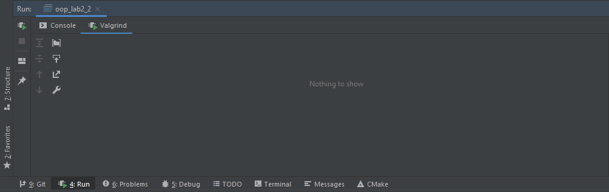

# 2-Course-OOP-Lab-2-task-2
Открыть консольное приложение.  Задать два не абстрактных класса, связанных в полиморфную иерархию: Class1 (базовый) и Class2. В главной функции программы создать несколько автоматических объектов этих типов. Затем посредством вызова функции my_copy скопировать эти объекты в базу данных (использовать vector), т. е. в базе данных должны оказаться копии созданных автоматических объектов.  Далее, вывести на консоль информацию о типе хранимых в БД объектах, используя typeid.  Исключить утечку памяти.

---
### Утечек памяти нет
 
